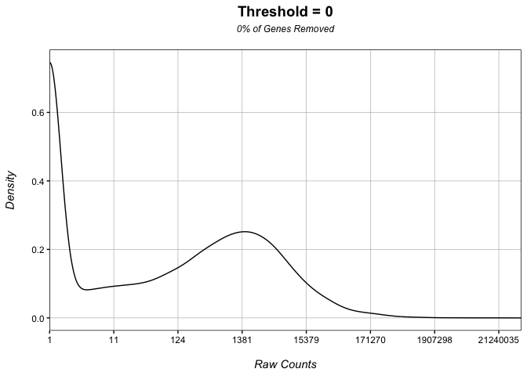
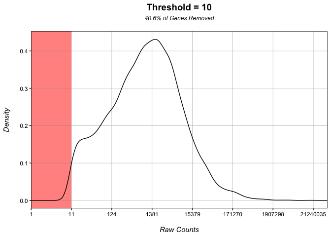
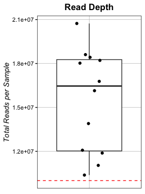
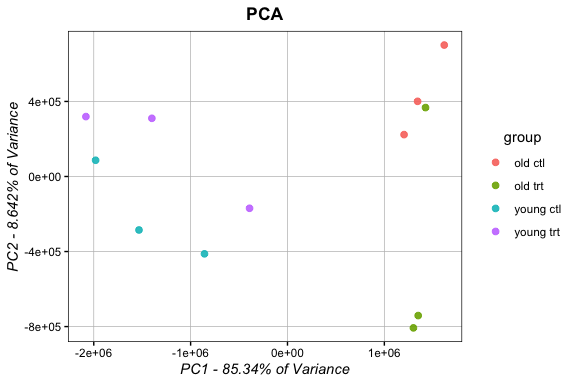
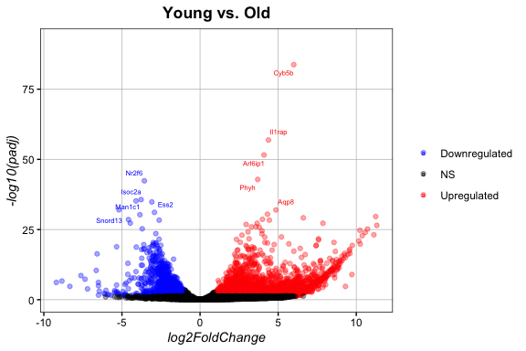
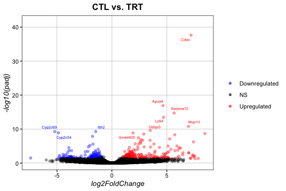
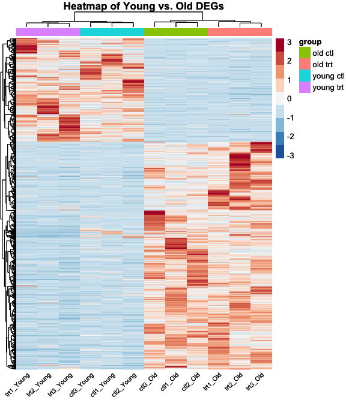
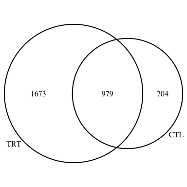
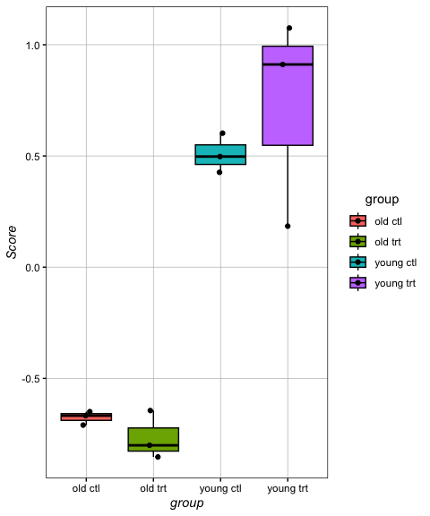

## Load packages and data

    # install packages if necessary:
    if (!require("remotes", quietly = TRUE))
      install.packages("remotes")
    if (!require("RNAseqFunctions", quietly = TRUE))
      remotes::install_github("katlande/RNAseq_Functions")
    if (!require("ggplot2", quietly = TRUE))
      BiocManager::install("DESeq2")
    if (!require("BiocManager", quietly = TRUE))
      install.packages("BiocManager")
    if (!require("DESeq2", quietly = TRUE))
      BiocManager::install("DESeq2")

    # load necessary packages:
    library(RNAseqFunctions)
    quietLib("ggplot2") # quietLib loads packages without messages and warnings
    quietLib("DESeq2")

    # load test data
    data(test_counts)
    data(test_design)

RNAseq experiments require two files. The first is a gene-by-sample
matrix of raw count data, that looks something like this:

    head(test_counts)
    ##          ctl1_Young ctl2_Young ctl3_Young ctl1_Old ctl2_Old ctl3_Old trt1_Young
    ## Mia2           2780       1370       2724     2224     1436     2400       2254
    ## Abraxas1          0          0         32      174       42       36          0
    ## Marchf1           2          0         38       14        2        4          0
    ## Mob3b           392         12        100      234      160      210        178
    ## Gm10487           0          0          0        0        0        0          0
    ## Mir145a           0          0          0        0        0        0          0
    ##          trt2_Young trt3_Young trt1_Old trt2_Old trt3_Old
    ## Mia2           1934       1888     2728     4364     2522
    ## Abraxas1         20         94       52       96       24
    ## Marchf1          14          0       38       32       32
    ## Mob3b           166         76      154      270      290
    ## Gm10487           0          0        0        0        0
    ## Mir145a           0          0        0        0        0

The row names are gene or transcript IDs, and the column names are
sample names. The included function homer\_to\_matrix() will convert the
output of Homer’s analyzeRepeats.pl into this format. The second file is
the meta data, which would look something like this:

    head(test_design)
    ##            treatment   age     group
    ## ctl1_Young       ctl young young ctl
    ## ctl2_Young       ctl young young ctl
    ## ctl3_Young       ctl young young ctl
    ## ctl1_Old         ctl   old   old ctl
    ## ctl2_Old         ctl   old   old ctl
    ## ctl3_Old         ctl   old   old ctl

The row names are sample names that match the column names of the counts
file, and the column names represent sample information. In thise case,
we have information about the treatment and age of our test samples.

## Set up data for analysis

Let’s make sure samples in our meta data have the same names and occur
in the same order as our count data. Samples with mismatched names or
those that occur in different orders may cause downstream errors.

    test_design <- checkMetaData(test_design, test_counts)
    ## Data matches!
    # Our files match, so no modification was made.
    # Dis-ordered data will be reordered, and mis-matched names will throw a warning.

For differential expression analysis with DEseq2, we’ll need to combine
our count and meta data into a DESeqDataSet object. How we design this
object depends on the comparisons we want to make. In the ‘design’
parameter, we add variables (columns of the meta data) that we want to
factor into our analysis. If we want to look at a single variable and
controlling for the other (for example, looking at the difference
between all young and all old samples, controlling for the effect of the
treatment), we would set up an object like this:

    D1 <- DESeqDataSetFromMatrix(countData = test_counts,
                                 colData = test_design,
                                 design = as.formula(~age+treatment))

However, if you wanted to make more specific comparisons, e.g., young
ctl vs. old ctl, you would set up your object like this:

    D2 <- DESeqDataSetFromMatrix(countData = test_counts,
                                 colData = test_design,
                                 design = as.formula(~group))

Basically, you will be able to make a comparison of any two levels in
any meta data column included in the design, and other columns in the
design will be controlled for. The design formula can be made more
complex to account for additive and non-additive variables, fixed and
random variables, and crossed and nested designs. The design for D1
assumes age and treatment are additive variables in a crossed design.
See some examples of other formulas you could set up:

    design = as.formula(~ factorA:factorB) # returns only the interaction of factorA and factorB.
    design = as.formula(~ factorA*factorB) # returns (~ factorA + factorB + factorA:factorB), i.e., non-interacting factorA and factorB, plus interaction of factorA and factorB. Used for a crossed design when factorA and factorB are non-additive.
    design = as.formula (~ factorB %in% factorA) # when factorB is nested within factorA; this can also be written as: (~factorA/factorB)
    design = as.formula(~(1|factorA/factorB)) # when factorB is nested and crossed within factorA.

Finally, we will need to identify a minimum read cut-off to remove lowly
and non-expressed genes. A large chunk of the transcriptome will not be
expressed in any given sample, and these genes will create noise if not
removed. We can identify a good filtering threshold using the
Check\_Filter() function:

    Check_Filter(D1) # this is a density plot of total reads per gene 

    Check_Filter(D1, 10) # this is the same density plot, but genes with less than 10 total reads are removed.

Using a cut-off of 10 sufficiently removes the non-expressed genes.

## Quality Control

The last step before differential expression analysis is quality control
to make sure the data is usable.

### Read depth

If too few reads are sequenced in any of our samples, they won’t give us
reliable information. In general, a minimum read depth of ~10 million is
a good threshold for mouse and human. This number will be larger or
smaller for larger and smaller transcriptomes, respectively.

    CheckDepth(test_counts, minDepth = 1e07)

    # All samples have appropriate read depth above our minimum threshold.

### Sample clustering

We expect samples to group together based on meta data variables. We can
confirm this with a PCA.

    customPCA(D1, # DESeqDataSet
              test_design, # meta data
              ptcol = "group", # colour the points based on this column of test_design
              filter_threshold = 10) # the threshold we determined previously

Here we can see that a massive portion of the transcriptional variance
is explained by age (~85%). There is also separation between treatment
and control samples within age groups, but it’s a little noisier. We can
expect that there will be a lot more differentially expressed genes
between young and old than there will be between treatment and control.

PCAs can also be used to identity outliers (single samples that cluster
strangely), and potential sample swaps (e.g., one young sample that
clusters with old samples and one old sample that clusters with young
samples on the same PCA *might* indicate that the sample IDs of these
two samples were swapped).

## Differential Expression

There are many tools for calcualting differential expression, but in
this tutorial we’ll be using DESeq2. The following function will filter,
normalize, and run DESeq2 on a DESeqDataSet object:

    Dnorm1 <- DESeq_and_Filt(D1, filter_thresh = 10,  minSamples = 2) # minimum of 2 of samples with > 0 reads required for gene inclusion
    Dnorm2 <- DESeq_and_Filt(D2, filter_thresh = 10, minSamples = 2) 

These Dnorm objects contain differential expression information for all
possible comparisons based on the design of the input object. Dnorm1
contains a comparison of ages controlling for treatment, and a
comparison of treatments controlling for ages. Dnorm2 contains all
pairwise comparisons of the ‘group’ column in the metadata: ‘young trt’
vs. ‘old trt’, ‘young trt’ vs. ‘young ctl’, etc. We can extract these
differential expression statistics into a data.frame using the
makeComp() function:

    young_old_all <- makeComp(Dnorm1, var = "age", up="old", down="young") # var = a variable in 'design'; up/down = which level is up and down regulated in the comparison.
    ctl_trt_all <- makeComp(Dnorm1, "treatment", "trt", "ctl") 

    # just looking age the effect of treatment within age groups:
    young_old_ctl <- makeComp(Dnorm2, "group", "old ctl", "young ctl") 
    young_old_trt <- makeComp(Dnorm2, "group", "old trt", "young trt") 

    # These dataframes look like this:
    head(young_old_all)
    ##                 baseMean log2FoldChange     lfcSE      stat       pvalue
    ## Mia2          2218.33888      0.2801533 0.2607599 1.0743726 0.2826556995
    ## Abraxas1        47.41611      1.6237780 1.2882173 1.2604846 0.2074946102
    ## Marchf1         13.38804      0.9157091 1.4988117 0.6109567 0.5412282314
    ## Mob3b          177.04860      0.6666551 0.5956179 1.1192663 0.2630265330
    ## 1810034E14Rik   23.16251      4.1775213 1.2011733 3.4778672 0.0005054203
    ## Crat           589.43951      0.7836559 0.4124474 1.9000142 0.0574312521
    ##                      padj          Gene Dir
    ## Mia2          0.416958384          Mia2 old
    ## Abraxas1      0.331624129      Abraxas1 old
    ## Marchf1       0.662170454       Marchf1 old
    ## Mob3b         0.395290232         Mob3b old
    ## 1810034E14Rik 0.002492322 1810034E14Rik old
    ## Crat          0.125180326          Crat old

The two most important values for differential expression are
log2FoldChange, the magnitude of change, and pAdj, the adjusted p-value
of differential expression. Typically, differentially expressed genes
(DEGs) are defined as pAdj&lt;=0.05 and absolute(log2FC) &gt; 0.5 or
&gt; 1. Let’s see how many DEGs we get from each of these comparisons:

    getDEGs(young_old_all, lfc = 1) # absolute log2FC cut-off of 1. pAdj cut-off is set automatically to 0.05.
    ## [1] "4361 DEGs: 2995 upregulated; 1366 downregulated."
    getDEGs(ctl_trt_all, lfc = 1)
    ## [1] "340 DEGs: 203 upregulated; 137 downregulated."
    getDEGs(young_old_ctl, lfc = 1)
    ## [1] "2623 DEGs: 1683 upregulated; 940 downregulated."
    getDEGs(young_old_trt, lfc = 1)
    ## [1] "3761 DEGs: 2652 upregulated; 1109 downregulated."

As we predicted from the PCA, we see many more DEGs with age than we do
with treatment. We can also look at DEGs using volcano plots:

    eRupt(young_old_all, FCsig = 1)+ggtitle("Young vs. Old")

    eRupt(ctl_trt_all, FCsig = 1)+ggtitle("CTL vs. TRT")

We may want to visualize our differentially expressed genes with a
heatmap:

    normalized_counts <- filt.norm(D1, thresh=10) # generate a data.frame of normalized counts
    YOAdegs <- getDEGs(young_old_all, lfc = 1, direction = "all", mode = "vector") # a vector all DEGs in the aging samples

    # This is a pipe to pheatmap:
    Reliable_heatmap(normalized_counts, # values to plot
                     genes = YOAdegs, # only plot these genes
                     sample_meta = test_design, # meta data
                     annotation = T, # whether to add colour coding based on the meta data
                     annots = "group", # which columns of the meta data to colour code 
                     rowlabs = F, # whether to add row text
                     title = "Heatmap of Young vs. Old DEGs") 

If we want to check how much overlap we see between DEGs from multiple
comparisons, we can make a venn diagram:

    old_ctl <- getDEGs(young_old_ctl, lfc = 1, direction = "up", mode = "vector") # a vector all age-upregulated genes in the control samples
    old_trt <- getDEGs(young_old_trt, lfc = 1, direction = "up", mode = "vector") # a vector all age-upregulated genes in the treatment samples

    display_venn(list(old_ctl, old_trt), # a list of gene names to overlap 
                 category.names = c("CTL", "TRT")) # names of the gene sets

Many of the genes upregulated with age are common to both control and
treatment samples, but these samples also seem to have unique aging
signatures as well.

## Functions of Differentially Expressed Genes

Now that we know which genes change under different conditions, we can
check to see what functions/pathways they belong to. *For the rest of
the tutorial, we’ll focus only on the young\_old\_all data.*

    ORA <- WebGestalt_Pipe("ORA", # type of enrichment; either 'ORA' or 'GSEA'
                    young_old_all, # makeComp() output file
                    FC = 1, # absolute log2FC for significance
                    DB = "geneontology_Biological_Process_noRedundant", # which ontology to look at. Here we are using biological process; this is the default setting. See WebGestaltR::listGeneSet() for a fill list of options.
                    species = "mmusculus", # your species; this data is from mouse. Mouse is also the default setting. See WebGestaltR::listOrganism() for a fill list of options.
                    projectName = "YO_ORA") # This function will save the raw data to a folder with this name

The ORA results tell us which biological processes contain more DEGs
than we expect by random chance, here’s a bit of what these results look
like:

    head(ORA[c(3,8,10)])
    ##                                    description enrichmentRatio         FDR
    ## 1   nucleoside monophosphate metabolic process       -1.985967 0.001221773
    ## 2    nucleoside triphosphate metabolic process       -1.967510 0.001311558
    ## 101                  muscle tissue development        1.481263 0.005423823
    ## 102                              molting cycle        1.952426 0.006918359
    ## 104                      epidermis development        1.565358 0.018244517
    ## 103             glycerolipid metabolic process        1.429082 0.018244517

Here we see a significant increase in muscle tissue development and
molting cycle genes with age (positive enrichment), and a significant
decrease in nucleoside mono- and tri-phosphate metabolic process genes
with age (negative enrichment).

### Looking at gene sets of interest

You may be interested in the behaviour of a specific set of genes. In
this example, we’ll look at the following set of genes that’s related to
oxidative phosphorylation:

    OxPhos <- c("Ndufb10", "Ndufa10", "Ndufb9", "Atp5e", "Uqcrq", "Atp5o", "Ndufv3", 
                "Ppa1", "Ppa2", "Ndufb3", "Atp5a1", "Cox4i1", "Uqcr10", "Ndufa12", 
                "Cox5a", "Cox5b", "Cox7c", "Cox7b", "Cox17", "Atp6v1b2", "Atp5k", 
                "Ndufs4", "Atp5h", "Cox7a1", "Lhpp", "Ndufs3", "Ndufa1", "Cox6a1")

First, we can check if these genes are enriched in either the up- or
down-regulated DEGs. The function SetEnrichment() prints two values. The
first is the p-value of enrichment (Fisher’s Exact Test), the second is
the enrichment ratio. If the enrichment ratio is above 1, the genes are
enriched in the DEGs. If they are below 1, they are depleted from the
DEGs.

    oldDEGs <- getDEGs(young_old_all, lfc = 1, direction = "up", mode = "vector")
    youngDEGs <- getDEGs(young_old_all, lfc = 1, direction = "down", mode = "vector")

    SetEnrichment(OxPhos, # Genes of interest
                  oldDEGs, # All DEGs
                  young_old_all$Gene) # All filtered genes
    ## [1] 0.007146275 0.119003439
    # p=0.007146275, enrichment ratio=0.119003439
    # this means OxPhos genes are significantly depleted from the upregulated genes

    SetEnrichment(OxPhos, # Genes of interest
                  youngDEGs, # All DEGs
                  young_old_all$Gene) # All filtered genes
    ## [1] 1.349370e-21 7.005344e+01
    # p=1.349370e-21, enrichment ratio=70.05344
    # this means OxPhos genes are extremely significantly enriched in the downregulated genes!

We can also calculate set expression scores for each of our samples.
These values reflect the average relative expression of all genes in a
set, and as such take *normalized counts* as an input (do not use raw
counts or FPKMs).

    OxPhos_Scores <- SetScores(normalized_counts, OxPhos, test_design, out="data.frame") 
    head(OxPhos_Scores)
    ##       Sample treatment   age     group      Score
    ## 1   ctl1_Old       ctl   old   old ctl -0.6496537
    ## 2 ctl1_Young       ctl young young ctl  0.4973454
    ## 3   ctl2_Old       ctl   old   old ctl -0.6675475
    ## 4 ctl2_Young       ctl young young ctl  0.6024897
    ## 5   ctl3_Old       ctl   old   old ctl -0.7100029
    ## 6 ctl3_Young       ctl young young ctl  0.4264215

    # plot the scores:
    ggplot(OxPhos_Scores, aes(x=group, y=Score, fill=group))+
      geom_boxplot(colour="black")+ # boxplots of score for each group
      geom_jitter(height = 0, width=0.075)+ # one point for each sample
      Ol_Reliable() # custom plot theme

Here we see that age has a strong influence on oxphos gene expression,
while treatment does not. An important caveat about these plots is that
the score value is relative, and will change if different samples are
used for the input. *You cannot compare scores that are generated in two
separate commands.*
